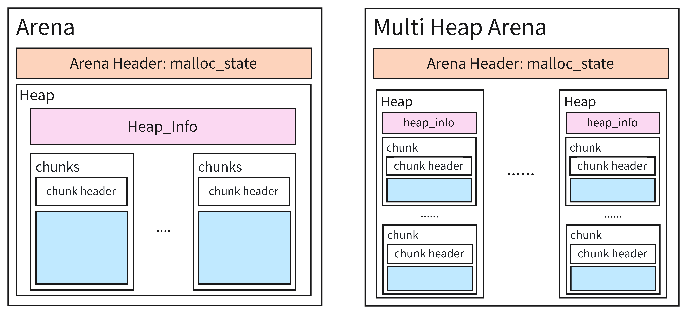
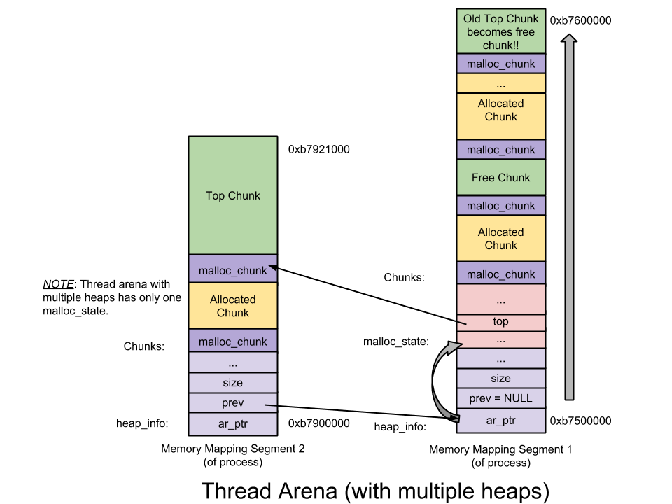

`malloc`: 负责请求系统调用(system call)分配内存。其实很多系统都有自己的 `malloc`:
- Dlmalloc – General purpose allocator (Linux早期使用的分配器)
- Ptmalloc2 – glibc (Linux 后来也使用了这个分配器)
- Jemalloc – FreeBSD and FireFox
- Tcmalloc – Google
- Libumem – Solaris

在讨论 glibc 之前, Linux 的内存分配原本使用的内存分配器为 dlmalloc, 这个内存分配器是不支持多线程分配的, 即当有多个线程同时使用dlmalloc分配内存时, 只会有一个线程实际得到内存, 只有一个线程能进入临界区。所以在 dlmalloc 在多线程分配的情况下性能会比较差。
在 ptmalloc2 中, 这个问题得到了解决。其方式是每个线程都有一个独立的存储区, 同时空闲内存表维护的内存块也是独立的。所以 ptmalloc2 可以做到多线程的分配, 本质原因是消除了临界区。

当某一个线程申请内存的时候, 例如 `malloc(1000)` 时, 实际上 glibc malloc 并不会只申请 1000 Byte 而是会申请更多内存存放在自己管理的区域, 称之为 main arena。 在之后的所有申请中 都会从 main arena 这个区域申请内存直到用完为止, 但是用完之后依旧会继续扩容。arena 是由一个又一个的 chunk 组成的。同时当主线程的内存 free 之后, 内存并不会直接换给操作系统而是驻留glibc malloc中, 即放回 main arena bin 中, 之后用户再次申请内存时, glibc就不会再次申请内存, 而是继续在 main arena bin 中寻找空闲区块。整个内存的申请和管理都是对 malloc 的调用者透明的。

由于某一个线程申请了 1000 Byte, 同时实际上 管理 glibc malloc 申请了更多内存(eg: 132KB), 这 132KB 内存的读写权限就被设置到了主线程。


所有 Arena 的个数是系统决定的但是肯定小于等于系统核心数。
在线程第一次创建出 Arena 时, 是不存在竞争的。 所有线程是各有各的 Arena。但是当 main arena 的空间不够的时候, 才会出现竞争。其原因是多个线程可能会复用同一个 thread arena。
所谓复用, 当一个线程想创建 arena 时但 main arena 中又没有成功创建新的 thread arena 时(arena 的数量达到了系统上限), 该线程会遍历所有的 arena(包括main arena), 即
1. 遍历所有的 arena, 一旦遍历成功自旋申请该 arena 的锁
2. 上锁成功, 将该 arena 返回给用户
3. 遍历失败, 则 malloc 阻塞, 直到有可用的 arena 为止

当该线程再次 malloc 时, 会尝试用上次用过的 arena

**arena**:
具体来说, 一个 arena 是由若干数据结构组成的:



这只是一个示意图, 实际的空间排布有明确的安排的。入下：




thread arena 中存有 heap 结果, 初始的情况下 thread arena 只有一个 heap, 如果该 heap 耗尽, 则会通过 system call mmap 进行扩展为非连续的内存。 
thread arena 是可以有多个堆的, 但是 main arena 是没有多个堆的(所以也不需要heap info), 因为 main arena 只是一个全局变量, 是定义在 glibc/malloc.c 的一个全局变量, 其不能使用 system call mmap 进行扩充, 只能使用 system call brk 进行有限的扩展。

**chunk**:
而真正可以被用户使用的内存就是 chunk, 在 heap 中 chunk 有以下类型:
1. Allocated chunk: 已经分配的 chunk
2. Free chunk: 还没有分配的 chunk
3. Top chunk: 栈底的 chunk, 也就是最后一个 chunk
4. Last Remainder chunk: 特殊的空闲内存块(Free Chunk)，用于优化连续小内存分配的性能,它记录最近一次分割大块内存时剩余的碎片，以便下次分配时优先复用，减少内存碎片化

```C
#define PREV_INUSE 0x1     // 置1表示上一个chunk被分配
#define IS_MMAPPED 0x2     // 置1表示这一个chunk被mmaped
#define NON_MAIN_ARENA 0x4 // 置1表示这一个chunk属于一个thread arena
struct malloc_chunk {
  INTERNAL_SIZE_T      prev_size;  /* Size of previous chunk (if free).  */
  // 若上一个chunk可用, 则此结构成员赋值为上一个chunk的大小
  // 否则若上一个chunk被分配, 此结构成员赋值为上一个chunk的用户数据大小
  // 对于一个空闲的 chunk 来说:
  // 两个空闲的chunks不能毗连，当有两个chunks都空闲的时候，他们会合并成一个空闲的chunk,
  // 因此前一个chunk和这一个空闲chunk都会被分配，此时prev_size中保存上一个chunk的用户数据。
  INTERNAL_SIZE_T      size;       /* Size in bytes, including overhead. */
  // 用于 bins 这个数据结构中
  struct malloc_chunk* fd;         /* double links -- used only if free. */
  struct malloc_chunk* bk;

  /* Only used for large blocks: pointer to next larger size.  */
  struct malloc_chunk* fd_nextsize; /* double links -- used only if free. */
  struct malloc_chunk* bk_nextsize;
};
```


**bins**
bins 本质就是一个空闲列表数据结构, 用于关系空闲的 chunk。 基于chunk的大小，可分为下列几种bins:
1. Fast bin: 大小 16~80 byte的chunk (默认是 16~64Btye)
2. Unsorted bin: 相当于一个缓冲, chunk被释放之后不会马上回到本来的bin中, 而是会驻留在unsorted bin中, 用于 glic 的复用。这样再次 malloc 的时候就不需要再次找合适的 bin。同时 unsorted bin 是没有大小限制的, 也只有一个。任何chunk都能加入
3. Small bin: 小于 512Byte的 chunk 都在 Small Bin 中
4. Large bin: 大小大于等于512Byte的 chunk 都在 arge bins 中

**Fast bin** 一共有10个
Fast bin 存于 `fastbinsY` 这个数组中。采用单链表是出于fast bin中chunk不会被从链表的中间移除的特点，增删 chunk都发生在链表的前端。 -LIFO
Fast bins 包含着大小以8字节递增的bin链表。也即，fast bin(index 0)包含着大小为16字节的chunk的binlist、fast bin(index 1)包含着大小为24字节的chunk的binlist 依次类推。同时指定fast bin中所有chunk大小均相同

<u>malloc on fast bins</u>:
`malloc` 的时候, 从 fast bin 中检索到, 并从 fast bin 中移除返回给用户
`free` 时, 把节点插入 fast bin 头部


`bins` 这个数组用以保存unsorted、small以及large bins，共计126个：
1. Bin 1 – unsorted bin
2. Bin 2 to Bin 63 – small bin
3. Bin 64 to Bin 126 – large bin

**Small bin** 一共62个
记录着大小以8字节递增的bin链表。也即，第一个small bin(Bin 2)记录着大小为16字节的chunk的binlist、small bin(Bin 3)记录着大小为24字节的chunk的binlist 依次类推
两个毗连的空闲chunk会被合并成一个空闲chunk。合并消除了碎片化的影响但是减慢了free的速度。

**Large bin** 一共63个
每个large bin都包括一个空闲chunk的双向循环链表（也称binlist）。free掉的chunk添加在链表的前端，而所需chunk则从链表后端摘除。-FIFO


超过63个之后
- 前32个bin记录着大小以64字节递增的bin链表，也即第一个large bin(Bin 65)记录着大小为512字节~568字节的chunk的binlist、第二个large bin(Bin 66)记录着大小为576字节到632字节的chunk的binlist，依次类推……
- 后16个bin记录着大小以512字节递增的bin链表
- 后8个bin记录着大小以4096字节递增的bin链表
- 后4个bin记录着大小以32768字节递增的bin链表
- 后2个bin记录着大小以262144字节递增的bin链表
- 最后1个bin记录着大小为剩余大小的chunk

不像small bin，large bin 里面的chunk都是大小不一，因此它们需要递减保存，最大的chunk保存在binlist的最前端，最小的chunk保存在最尾端


**Top Chunk**: 位于arena最顶端的chunk被成为top chunk，它不属于任何一个bin，当所有的bin都没有空闲块的时候，top chunk才会响应用户的请求，如果top chunk的大小大于用户请求的大小，那么top chunk就会被划分成两部分：

User chunk（用户请求大小）
Remainder chunk（剩余大小） Remainder chunk就变成了新的top chunk，如果top chunk的大小小余用户请求的大小，那么top chunk就会使用sbrk或者mmap系统调用来扩容

|            | Fast Bin  | Unsorted Bin | Small Bin         | Large Bin                       |
| ---------- | --------- | ------------ | ----------------- | ------------------------------- |
| 数量       | 10        | 1            | 62                | 63                              |
| chunk size | 8字节递增 | -            | 8字节递增         | 64512;4096;32768;262144Byte递增 |
| 结构       | 单链表    | 双向循环链表 | 双循环链表        | 双循环链表                      |
| 合并策略   | 不合并    | -            | 合并相邻空闲chunk | 合并相邻空闲chunk               |
| 分配顺序   | LIFO      | -            | FIFO              | FIFO                            |

**malloc**:
1. 初始时, 所有的 bin 均是 NULL, 只有 Top Chunk 是存在的(初始大小为0)
2. 用户发起 malloc 请求时, 直接使用top chunk响应
3. 由于top chunk初始大小为0，会先通过 sbrk 扩展堆空间
4. 然后从扩展后的 top chunk 中分配请求的内存

**free**
free 时会先放回到 unsorted bin中 
以下情况中 会将 unsorted 中的 chunk 重新放回原本的chunk
1. 当 malloc 遍历 unsorted bin 但未找到合适 chunk 时​
2. 当 unsorted bin 中的 chunk 被合并时, 如果释放的 chunk 与相邻的 free chunk 合并，新合并的 chunk 可能会被放入 unsorted bin，随后在 malloc 时被重新归类
   1. 合并后的 chunk 如果属于 small bin 范围​​：放入对应的 small bin
   2. ​合并后的 chunk 如果属于 large bin 范围​​：放入对应的 large bin

```C
void *p1 = malloc(200);  // 从 top chunk 分配
free(p1);                // p1 进入 unsorted bin
void *p2 = malloc(100);  // 遍历 unsorted bin：
                         // - p1 (200) 比 100 大，分割：
                         //   - 返回 100 给用户
                         //   - 剩余 100 放回 unsorted bin
void *p3 = malloc(300);  // 再次遍历 unsorted bin：
                         // - 剩余 chunk (100) 不匹配 300
                         // - 100 < 512，放入 small bin[12]（104B）
                         // 然后从 top chunk 分配 300
// ===============================================================
void *p1 = malloc(200);  // 分配 200
void *p2 = malloc(200);  // 分配 200
free(p1);                // p1 进入 unsorted bin
free(p2);                // p2 与 p1 合并（如果内存连续）
                         // 合并后的 chunk (400) 进入 unsorted bin
void *p3 = malloc(100);  // 遍历 unsorted bin：
                         // - 400 > 100，分割：
                         //   - 返回 100
                         //   - 剩余 300 放入 unsorted bin
void *p4 = malloc(500);  // 再次遍历 unsorted bin：
                         // - 300 < 500，不匹配
                         // - 300 < 512，放入 small bin[36]（304B）
                         // 然后从 top chunk 分配 500
```
Eg：
```C
int main() {
    // 初始化时 - 使用top chunk
    void *p1 = malloc(100);  // 第一次分配，top chunk扩展后分配
    // 分配fast chunk
    void *p2 = malloc(20);   // 从fast bin分配
    free(p2);                // 释放到fast bin
    // 再次分配相同大小 - 从fast bin响应
    void *p3 = malloc(20);   // 从fast bin[2]分配
    // 分配small chunk
    void *p4 = malloc(200);  // 从small bin分配
    free(p4);                // 释放到unsorted bin
    // 再次分配 - 可能从unsorted bin响应
    void *p5 = malloc(200);  // 从unsorted bin分配
    // 分配large chunk
    void *p6 = malloc(600);  // 从large bin分配
    free(p6);                // 释放到unsorted bin
    // 再次分配 - 可能从unsorted bin或large bin响应
    void *p7 = malloc(600);  // 从large bin分配
    return 0;
}
```
初始状态: 在程序开始执行 main() 之前，内存状态如下:
- Main Arena​​ 已初始化但为空
- ​​Top chunk​​ 大小为 0
- 所有 ​​fast bins​​、​​small bins​​、​​large bins​​ 和 ​​unsorted bin​​ 都为空
- 堆段尚未分配

> `void *p1 = malloc(100)`: 
1. 检查 fast bins​​：请求大小 100 不在 fast bin 范围 (16-64)，跳过
2. 检查 small bins​​：请求大小 100 在 small bin 范围 (<512)，但所有 small bins 为空
3. ​检查 unsorted bin​​：为空
4. 检查 large bins​​：请求大小 < 512，跳过
5. ​使用 top chunk​​：
   1. 当前 top chunk 大小为 0
   2. 调用 sbrk 扩展堆：
      1. 默认第一次扩展 132KB (0x21000 字节)
      2. 新 top chunk 地址 = 初始堆基址 (如 0x0804b000)
      3. 新 top chunk 大小 = 0x21000 - 0x100 = 0x20f00 (减去 chunk 头)
   3. ​分割 top chunk​​：
      1. 分配 100 字节：
      2. 实际需要 100 + chunk 头 (8) = 108 字节
      3. 对齐到 112 字节
   4. 从 top chunk 切出 112 字节：
      1. 分配 chunk 地址: 0x0804b000
      2. 剩余 top chunk: 0x0804b070, 大小 0x20e90

此时所有 bins 仍为空
堆布局:
| 地址        | 指针              | 大小           |
| ----------- | ----------------- | -------------- |
| 0x0804b000: | 已分配 chunk (p1) | [size=112]     |
| 0x0804b070: | top chunk         | [size=0x20e90] |

> `void *p2 = malloc(20)`:
1. ​检查 fast bins​​：
   1. 请求大小 20 在 fast bin 范围 (16-64)
   2. fast bin[1] 对应大小 24 (16 + 8 * 1)
   3. fast bin[1] 为空
2. 检查 small bins​​：
   1. small bin[2] 对应大小 24
   2. 为空
3. 使用 top chunk​​：
   1. 从 top chunk 分配：
      1. 需要 20 + 8 = 28 字节
      2. 对齐到 32 字节
   2. 切出 32 字节：
      1. 分配 chunk 地址: 0x0804b070
      2. 剩余 top chunk: 0x0804b090, 大小 0x20e70

所有 bins 仍为空
堆布局:
| 地址        | 指针      | 大小           |
| ----------- | --------- | -------------- |
| 0x0804b000: | p1        | [size=112]     |
| 0x0804b070: | p2        | [size=32]      |
| 0x0804b090: | top chunk | [size=0x20e70] |


> `free(p2)`:
1. 检查 chunk 大小​​：
   1. p2 大小 32 字节，属于 fast chunk
2. ​放入 fast bin​​：
   1. fast bin[1] (24 字节)：
      1. 虽然实际大小是 32，但 fast bin 按索引计算
      2. 32 字节对应 fast bin[2] (16 + 8 * 2 = 32)
   2. 将 p2 (0x0804b070) 加入 fast bin[2] 的链表头部

内存变化:
Fast bins​​: fast bin[2]: 0x0804b070 -> NULL
Top Chunk: 不变
堆布局:
0x0804b000: p1 [size=112]
0x0804b070: free chunk (in fast bin[2]) [size=32]
0x0804b090: top chunk [size=0x20e70]


> `void *p3 = malloc(20)`:
1. 检查 fast bins​​：
   1. 请求大小 20
   2. 计算 fast bin 索引: (20+7)/8 = 3.375 → 向上取整 4 → 32 字节 (fast bin[2])
   3. fast bin[2] 非空 (有 p2)
2. 从 fast bin 分配​​：
   1. 从 fast bin[2] 取出第一个 chunk (0x0804b070)
   2. 设置 fast bin[2] 为 NULL
   3. 返回地址 0x0804b070 + 8 = 0x0804b078

Fast bins​​: fast bin[2]: NULL
​​Top chunk​​: 不变
堆内存布局:
| 地址       | 指针      | 大小                 |
| ---------- | --------- | -------------------- |
| 0x0804b000 | p1        | [size=112]           |
| 0x0804b070 | p3        | [size=32] (重新使用) |
| 0x0804b090 | top chunk | [size=0x20e70]       |

> `void *p4 = malloc(200)`

1. 检查 fast bins​​：200 > 64，跳过
2. ​检查 small bins​​：
   1. 200 + 8 = 208
   2. 对齐到 208 (small bin 不需要额外对齐)
   3. small bin[25] 对应大小 208 (16 + 8 * 24)
   4. small bin[25] 为空
3. 检查 unsorted bin​​：为空
4. 使用 top chunk​​：
   1. 从 top chunk 分配 208 字节
   2. 分配 chunk 地址: 0x0804b090
   3. 剩余 top chunk: 0x0804b160, 大小 0x20cc8

​​Top chunk​​:
地址: 0x0804b160
大小: 0x20cc8
Bins​​: 所有 bins 仍为空
堆布局:

| 地址        | 指针      | 大小           |
| ----------- | --------- | -------------- |
| 0x0804b000: | p1        | [size=112]     |
| 0x0804b070: | p3        | [size=32]      |
| 0x0804b090: | p4        | [size=208]     |
| 0x0804b160: | top chunk | [size=0x20cc8] |

> `free(p4)`
1. 检查 chunk 大小​​：
   1. p4 大小 208 字节，不是 fast chunk
2. 放入 unsorted bin​​：
   1. 将 p4 (0x0804b090) 加入 unsorted bin 的链表头部
   2. unsorted bin: 0x0804b090 → NULL

​​Unsorted bin​​:
0x0804b090 → NULL
​​Top chunk​​: 不变
​​堆布局​​：
| 地址        | 指针                         | 大小           |
| ----------- | ---------------------------- | -------------- |
| 0x0804b000: | p1                           | [size=112]     |
| 0x0804b070: | p3                           | [size=32]      |
| 0x0804b090: | free chunk (in unsorted bin) | [size=208]     |
| 0x0804b160: | top chunk                    | [size=0x20cc8] |

> `void *p5 = malloc(200)`

​1. ​检查 fast bins​​：200 > 64，跳过
2. ​​检查 small bins​​：
   1. small bin[25] (208) 为空
3. 检查 unsorted bin​​：
   1. 有 1 个 chunk (p4, 208 字节)
   2. 精确匹配请求大小 (208)
   3. 从 unsorted bin 取出 p4
   4. 返回 p4 (0x0804b090 + 8 = 0x0804b098)

​​Unsorted bin​​: NULL
​​Top chunk​​: 不变
​​堆布局​​:
| 地址        | 指针      | 大小                     |
| ----------- | --------- | ------------------------ |
| 0x0804b000: | p1        | [size=112]               |
| 0x0804b070: | p3        | [size=32]                |
| 0x0804b090: | p5        | [size=208] (重新使用 p4) |
| 0x0804b160: | top chunk | [size=0x20cc8]           |

> `void *p6 = malloc(600)`

1. 检查 fast bins​​：600 > 64，跳过
2. 检查 small bins​​：600 >= 512，属于 large chunk
3. ​检查 unsorted bin​​：为空
4. ​​检查 large bins​​：
   1. 600 属于 large bin[65] (512-568) 和 large bin[66] (576-632)
   2. 两个 bin 都为空
5. ​使用 top chunk​​：
   1. 当前 top chunk 大小 0x20cc8 (134,856 字节)
   2. 需要 600 + 8 = 608 字节
   3.  从 top chunk 切出 608 字节：
       1.  分配 chunk 地址: 0x0804b160
       2.  剩余 top chunk: 0x0804b3c0, 大小 0x20ac0  

Top chunk​​:
地址: 0x0804b3c0
大小: 0x20ac0
​​Bins​​:
所有 bins 为空
​​堆布局​​:
| 地址        | 指针      | 大小           |
| ----------- | --------- | -------------- |
| 0x0804b000: | p1        | [size=112]     |
| 0x0804b070: | p3        | [size=32]      |
| 0x0804b090: | p5        | [size=208]     |
| 0x0804b160: | p6        | [size=608]     |
| 0x0804b3c0: | top chunk | [size=0x20ac0] |

**总得来说**, malloc 寻找 bin 的策略为: 检查 fast bins -> 检查 small bins -> 遍历 unsorted bin -> 检查 large bins -> 使用 top chunk (空间不够sys call扩展堆) -> sys call mmap

[参考文献](https://github.com/JnuSimba/LinuxSecNotes/blob/master/Linux%20%E7%B3%BB%E7%BB%9F%E5%BA%95%E5%B1%82%E7%9F%A5%E8%AF%86/%E6%B7%B1%E5%85%A5%E7%90%86%E8%A7%A3glibc%20malloc.md)

[glibc/malloc.c](https://github.com/sploitfun/lsploits/blob/master/glibc/malloc/malloc.c)

[Understanding glibc malloc 原文](https://sploitfun.wordpress.com/2015/02/10/understanding-glibc-malloc/comment-page-1/?blogsub=confirming#subscribe-blog%E3%80%82)
